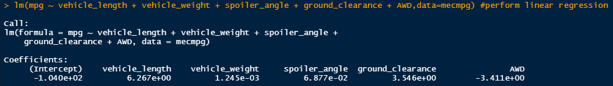
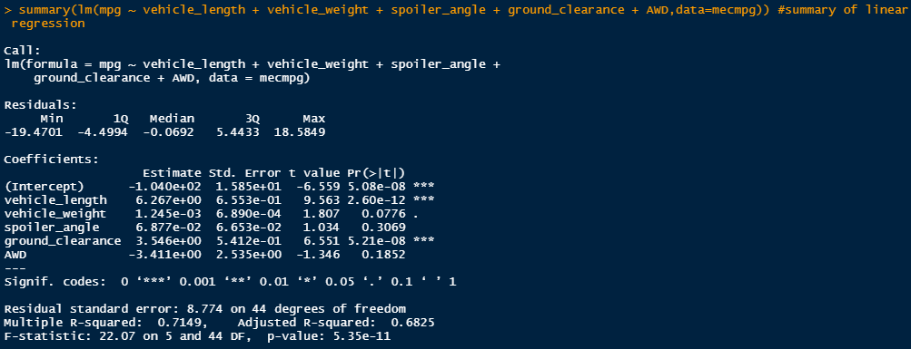
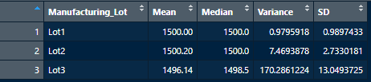
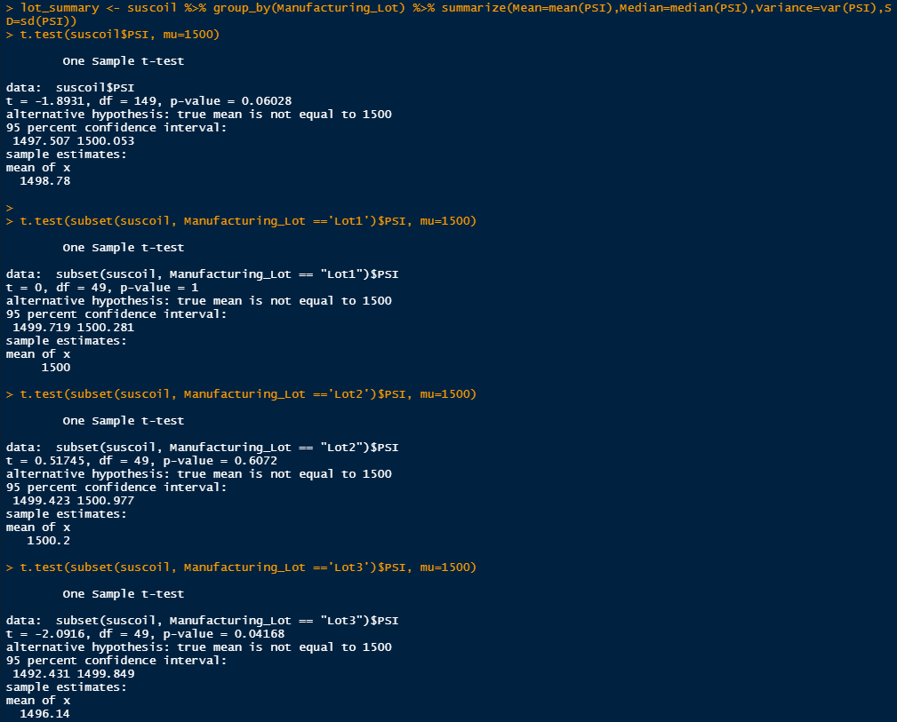

# MechaCar_Statistical_Analysis
AutosRUs’ newest prototype, the MechaCar, is suffering from production troubles. We will review the production data for insights that may help the manufacturing team.
## Linear Regression to Predict MPG
We will use multiple metrics, such as vehicle length, vehicle weight, spoiler angle, drivetrain, and ground clearance to design a linear model that predicts the mpg of MechaCar prototypes. 

Linear Regression Model

Summary of Linear Regression

Let's use this model to answer the following questions:
1. Which variables/coefficients provided a non-random amount of variance to the mpg values in the dataset?
   - Vehicle Lengeth and Ground Clearance provide a non-random amount of variance based on their p-values being less than 0.05.
2. Is the slope of the linear model considered to be zero? Why or why not?
   - No, the coefficients are also slop indicatoras and none of the coefficients are zero.
3. Does this linear model predict mpg of MechaCar prototypes effectively? Why or why not?
   - The R-suared value indicated that this model will be approximately 71% accurate in predicting the mpg.

## Summary Statistics on Suspension Coils
According to the design specifications for the MechaCar suspension coils, the variance of the suspension coils must not exceed 100 pounds per square inch. Let's take a look at the suspension coil test results.

Summary of all test results.

Summary of test results by lot.

Let's use these summaries to answer the following question:
1. Does the current manufacturing data meet this design specification for all manufacturing lots in total and each lot individually? Why or why not?
   - Looking at the summary of all test results we see that the total variance is 62.29356, which is below the 100 PSI specification, but when we look at the individual lots we can see that Lot3 is actually out of spec at 170.2861224.

## T-Tests on Suspension Coils
Lets perform t-tests to determine if all manufacturing lots and each lot individually are statistically different from the population mean of 1,500 pounds per square inch.

Looking at the p=values we can see that the only lot that is statistically different from the mean of 1,500 PSI is Lot3)

## Study Design: MechaCar vs Competition
Hypothesis: MechaCar has better mpg than the competition.

1. What metric or metrics are you going to test?
   - We will compare the mpg of MechaCar against competitors of similar class. 
2. What is the null hypothesis or alternative hypothesis?
   - The MechaCar does not have better MPG than the competition. 
3. What statistical test would you use to test the hypothesis? And why?
   - ANOVA test will probably work best to compare multiple competitors against the MechaCar at the same time.
4. What data is needed to run the statistical test?
   - We will need similar datasets for mpg for each competitor that we want to check.
